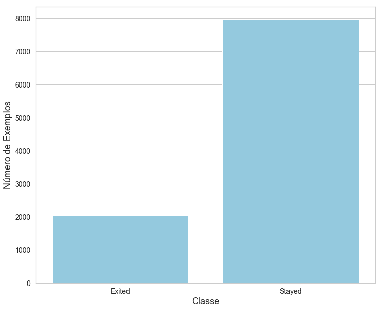
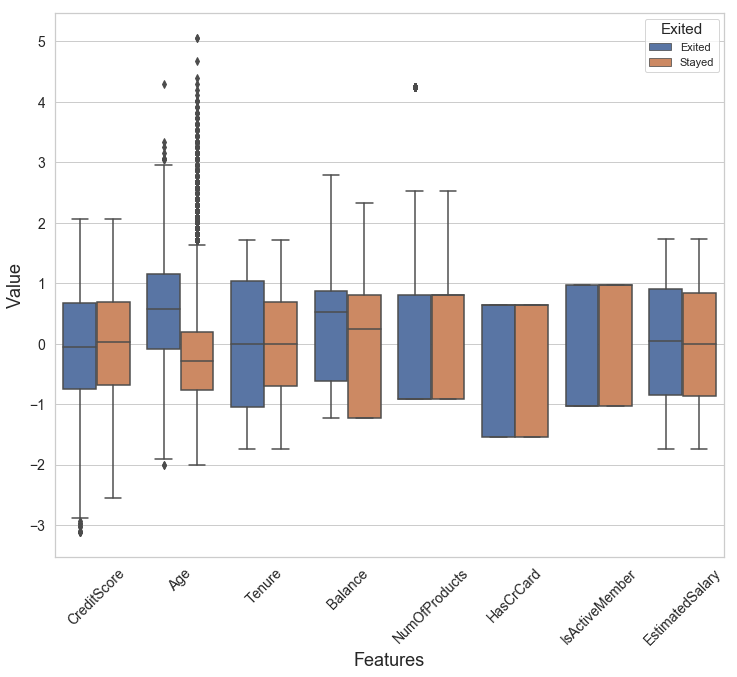
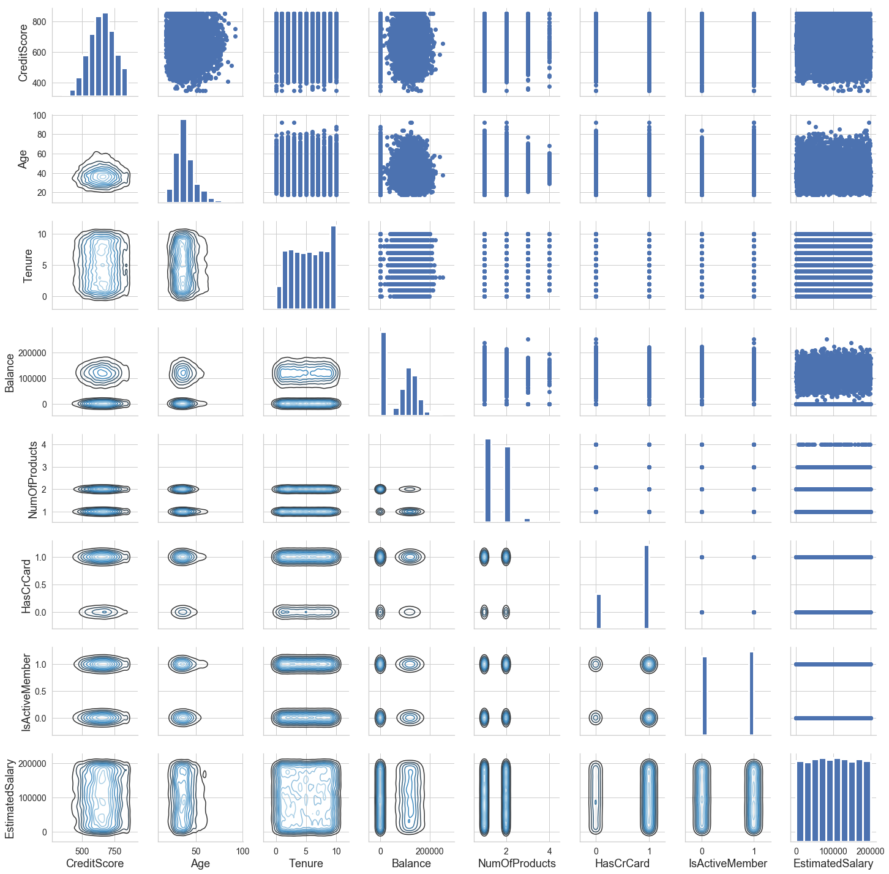
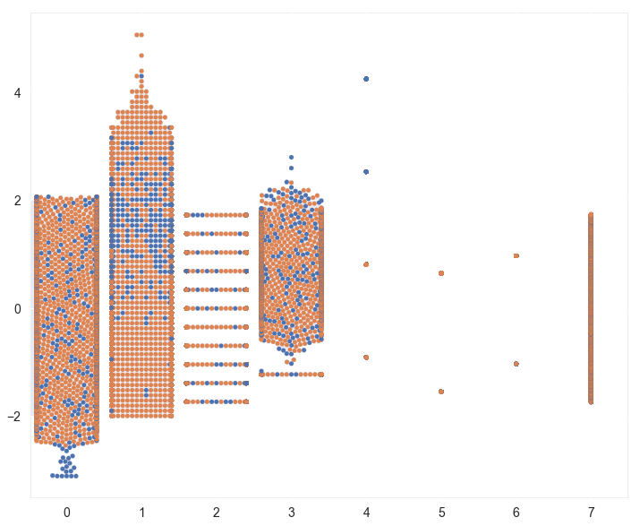

```python
%pylab inline
import pandas as pd
import numpy as np
import matplotlib.pyplot as plt
import seaborn as sns
```

    Populating the interactive namespace from numpy and matplotlib
    


```python
df = pd.read_csv('Churn-Modelling.csv')
```


```python
df.head()
```


<div>
<style scoped>
    .dataframe tbody tr th:only-of-type {
        vertical-align: middle;
    }

    .dataframe tbody tr th {
        vertical-align: top;
    }

    .dataframe thead th {
        text-align: right;
    }
</style>
<table border="1" class="dataframe">
  <thead>
    <tr style="text-align: right;">
      <th></th>
      <th>RowNumber</th>
      <th>CustomerId</th>
      <th>Surname</th>
      <th>CreditScore</th>
      <th>Geography</th>
      <th>Gender</th>
      <th>Age</th>
      <th>Tenure</th>
      <th>Balance</th>
      <th>NumOfProducts</th>
      <th>HasCrCard</th>
      <th>IsActiveMember</th>
      <th>EstimatedSalary</th>
      <th>Exited</th>
    </tr>
  </thead>
  <tbody>
    <tr>
      <th>0</th>
      <td>1</td>
      <td>15634602</td>
      <td>Hargrave</td>
      <td>619</td>
      <td>France</td>
      <td>Female</td>
      <td>42</td>
      <td>2</td>
      <td>0.00</td>
      <td>1</td>
      <td>1</td>
      <td>1</td>
      <td>101348.88</td>
      <td>1</td>
    </tr>
    <tr>
      <th>1</th>
      <td>2</td>
      <td>15647311</td>
      <td>Hill</td>
      <td>608</td>
      <td>Spain</td>
      <td>Female</td>
      <td>41</td>
      <td>1</td>
      <td>83807.86</td>
      <td>1</td>
      <td>0</td>
      <td>1</td>
      <td>112542.58</td>
      <td>0</td>
    </tr>
    <tr>
      <th>2</th>
      <td>3</td>
      <td>15619304</td>
      <td>Onio</td>
      <td>502</td>
      <td>France</td>
      <td>Female</td>
      <td>42</td>
      <td>8</td>
      <td>159660.80</td>
      <td>3</td>
      <td>1</td>
      <td>0</td>
      <td>113931.57</td>
      <td>1</td>
    </tr>
    <tr>
      <th>3</th>
      <td>4</td>
      <td>15701354</td>
      <td>Boni</td>
      <td>699</td>
      <td>France</td>
      <td>Female</td>
      <td>39</td>
      <td>1</td>
      <td>0.00</td>
      <td>2</td>
      <td>0</td>
      <td>0</td>
      <td>93826.63</td>
      <td>0</td>
    </tr>
    <tr>
      <th>4</th>
      <td>5</td>
      <td>15737888</td>
      <td>Mitchell</td>
      <td>850</td>
      <td>Spain</td>
      <td>Female</td>
      <td>43</td>
      <td>2</td>
      <td>125510.82</td>
      <td>1</td>
      <td>1</td>
      <td>1</td>
      <td>79084.10</td>
      <td>0</td>
    </tr>
  </tbody>
</table>
</div>


```python
df = df.drop(['RowNumber', 'CustomerId', 'Surname'], axis=1)
```


```python
df.head()
```


<div>
<style scoped>
    .dataframe tbody tr th:only-of-type {
        vertical-align: middle;
    }

    .dataframe tbody tr th {
        vertical-align: top;
    }

    .dataframe thead th {
        text-align: right;
    }
</style>
<table border="1" class="dataframe">
  <thead>
    <tr style="text-align: right;">
      <th></th>
      <th>CreditScore</th>
      <th>Geography</th>
      <th>Gender</th>
      <th>Age</th>
      <th>Tenure</th>
      <th>Balance</th>
      <th>NumOfProducts</th>
      <th>HasCrCard</th>
      <th>IsActiveMember</th>
      <th>EstimatedSalary</th>
      <th>Exited</th>
    </tr>
  </thead>
  <tbody>
    <tr>
      <th>0</th>
      <td>619</td>
      <td>France</td>
      <td>Female</td>
      <td>42</td>
      <td>2</td>
      <td>0.00</td>
      <td>1</td>
      <td>1</td>
      <td>1</td>
      <td>101348.88</td>
      <td>1</td>
    </tr>
    <tr>
      <th>1</th>
      <td>608</td>
      <td>Spain</td>
      <td>Female</td>
      <td>41</td>
      <td>1</td>
      <td>83807.86</td>
      <td>1</td>
      <td>0</td>
      <td>1</td>
      <td>112542.58</td>
      <td>0</td>
    </tr>
    <tr>
      <th>2</th>
      <td>502</td>
      <td>France</td>
      <td>Female</td>
      <td>42</td>
      <td>8</td>
      <td>159660.80</td>
      <td>3</td>
      <td>1</td>
      <td>0</td>
      <td>113931.57</td>
      <td>1</td>
    </tr>
    <tr>
      <th>3</th>
      <td>699</td>
      <td>France</td>
      <td>Female</td>
      <td>39</td>
      <td>1</td>
      <td>0.00</td>
      <td>2</td>
      <td>0</td>
      <td>0</td>
      <td>93826.63</td>
      <td>0</td>
    </tr>
    <tr>
      <th>4</th>
      <td>850</td>
      <td>Spain</td>
      <td>Female</td>
      <td>43</td>
      <td>2</td>
      <td>125510.82</td>
      <td>1</td>
      <td>1</td>
      <td>1</td>
      <td>79084.10</td>
      <td>0</td>
    </tr>
  </tbody>
</table>
</div>


```python
X = df.iloc[:, :-1]
y = df.iloc[:, -1]
```


```python
y=y.map({0: 'Stayed', 1: 'Exited'})
```


```python
sns.set(rc={'figure.figsize':(12,10), 'axes.labelsize':18, 
            'xtick.labelsize': 14, 'ytick.labelsize': 14})
```


```python
f,ax = plt.subplots(figsize=(10, 10))
sns.heatmap(df.corr(), annot=True, linewidths=.5, fmt= '.1f', ax=ax)
```


    <matplotlib.axes._subplots.AxesSubplot at 0x17fe59bc3c8>


```python
ax = sns.countplot(y,label="Count")
ax.set(xlabel='Exited')
Exited, Stayed = y.value_counts()
```





```python
data_exit = y
data = X.drop(['Gender', 'Geography'], axis=1)

data_std = ((data - data.mean())/data.std())
```


```python
data = pd.concat([y, data_std.iloc[:,0:8]], axis=1)
data.rename(columns={data.columns[0]: 'Exited'}, inplace=True)

data = pd.melt(data,id_vars="Exited",
                    var_name="Features",
                    value_name='Value')

sns.violinplot(x="Features", y="Value", 
               hue="Exited", data=data,split=True, 
               inner="quart")
plt.xticks(rotation=45)
```


    (array([0, 1, 2, 3, 4, 5, 6, 7]), <a list of 8 Text xticklabel objects>)


```python
data = pd.concat([y, data_std], axis=1)
data = pd.melt(data,id_vars="Exited",
                    var_name="Features",
                    value_name='Value')

sns.boxplot(x="Features", y="Value", hue="Exited", data=data)
plt.xticks(rotation=45)
```


    (array([0, 1, 2, 3, 4, 5, 6, 7]), <a list of 8 Text xticklabel objects>)





```python
g = sns.PairGrid(X.drop(['Geography','Gender'], axis=1), diag_sharey=False)
g.map_lower(sns.kdeplot, cmap="Blues_d")
g.map_upper(plt.scatter)
g.map_diag(sns.kdeplot, lw=3)
```

    C:\Users\Inventario-LSE\Anaconda3\lib\site-packages\scipy\stats\stats.py:1713: FutureWarning: Using a non-tuple sequence for multidimensional indexing is deprecated; use `arr[tuple(seq)]` instead of `arr[seq]`. In the future this will be interpreted as an array index, `arr[np.array(seq)]`, which will result either in an error or a different result.
      return np.add.reduce(sorted[indexer] * weights, axis=axis) / sumval
    


    <seaborn.axisgrid.PairGrid at 0x17fe81ea9e8>





```python
data = pd.concat([y, data_std.iloc[:,0:8]], axis=1)

data = pd.melt(data,id_vars="Exited",
                    var_name="Features",
                    value_name='Value')

sns.swarmplot(x="Features", y="Value", hue="Exited", data=data)
```


    ---------------------------------------------------------------------------

    KeyboardInterrupt                         Traceback (most recent call last)

    <ipython-input-35-6870867e9d29> in <module>()
          5                     value_name='Value')
          6 
    ----> 7 sns.swarmplot(x="Features", y="Value", hue="Exited", data=data)
    

    ~\Anaconda3\lib\site-packages\seaborn\categorical.py in swarmplot(x, y, hue, data, order, hue_order, dodge, orient, color, palette, size, edgecolor, linewidth, ax, **kwargs)
       2989                        linewidth=linewidth))
       2990 
    -> 2991     plotter.plot(ax, kwargs)
       2992     return ax
       2993 
    

    ~\Anaconda3\lib\site-packages\seaborn\categorical.py in plot(self, ax, kws)
       1444     def plot(self, ax, kws):
       1445         """Make the full plot."""
    -> 1446         self.draw_swarmplot(ax, kws)
       1447         self.add_legend_data(ax)
       1448         self.annotate_axes(ax)
    

    ~\Anaconda3\lib\site-packages\seaborn\categorical.py in draw_swarmplot(self, ax, kws)
       1440         for center, swarm in zip(centers, swarms):
       1441             if swarm.get_offsets().size:
    -> 1442                 self.swarm_points(ax, swarm, center, width, s, **kws)
       1443 
       1444     def plot(self, ax, kws):
    

    ~\Anaconda3\lib\site-packages\seaborn\categorical.py in swarm_points(self, ax, points, center, width, s, **kws)
       1349 
       1350         # Do the beeswarm in point coordinates
    -> 1351         new_xy = self.beeswarm(orig_xy, d)
       1352 
       1353         # Transform the point coordinates back to data coordinates
    

    ~\Anaconda3\lib\site-packages\seaborn\categorical.py in beeswarm(self, orig_xy, d)
       1311             # Find the first candidate that does not overlap any neighbours
       1312             new_xy_i = self.first_non_overlapping_candidate(candidates,
    -> 1313                                                             neighbors, d)
       1314 
       1315             # Place it into the swarm
    

    ~\Anaconda3\lib\site-packages\seaborn\categorical.py in first_non_overlapping_candidate(self, candidates, neighbors, d)
       1269             dy = neighbors_y - y_i
       1270 
    -> 1271             sq_distances = np.power(dx, 2.0) + np.power(dy, 2.0)
       1272 
       1273             # good candidate does not overlap any of neighbors
    

    KeyboardInterrupt: 




